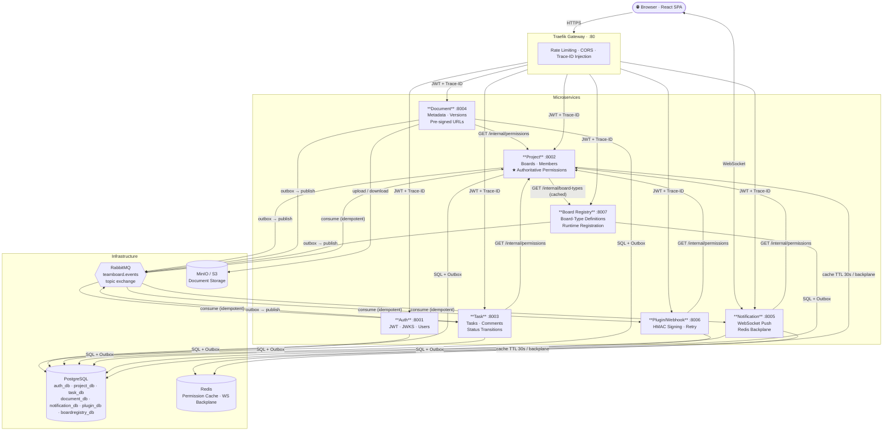

# TeamBoard — Architecture Diagram

```mermaid
graph TB
    Browser(["🌐 Browser · React SPA"])

    subgraph GW["Traefik Gateway · :80"]
        T["Rate Limiting · CORS · Trace-ID Injection"]
    end

    subgraph SVC["Microservices"]
        Auth["**Auth** :8001\nJWT · JWKS · Users"]
        Project["**Project** :8002\nBoards · Members\n★ Authoritative Permissions"]
        Task["**Task** :8003\nTasks · Comments\nStatus Transitions"]
        Document["**Document** :8004\nMetadata · Versions\nPre-signed URLs"]
        Notification["**Notification** :8005\nWebSocket Push\nRedis Backplane"]
        Plugin["**Plugin/Webhook** :8006\nHMAC Signing · Retry"]
        BoardRegistry["**Board Registry** :8007\nBoard-Type Definitions\nRuntime Registration"]
    end

    subgraph INFRA["Infrastructure"]
        PG[("PostgreSQL\nauth_db · project_db · task_db\ndocument_db · notification_db · plugin_db · boardregistry_db")]
        Redis[("Redis\nPermission Cache · WS Backplane")]
        MQ{{"RabbitMQ\nteamboard.events\ntopic exchange"}}
        S3[("MinIO / S3\nDocument Storage")]
    end

    Browser -- "HTTPS" --> GW
    Browser <-- "WebSocket" --> Notification
    GW -- "JWT + Trace-ID" --> Auth & Project & Task & Document & Notification & Plugin & BoardRegistry

    Task & Document & Notification & Plugin -- "GET /internal/permissions" --> Project
    Project -- "GET /internal/board-types (cached)" --> BoardRegistry

    Auth & Project & Task & Document & Notification & Plugin & BoardRegistry -- "SQL + Outbox" --> PG

    Project & Task & Document & BoardRegistry -- "outbox → publish" --> MQ
    MQ -- "consume (idempotent)" --> Task & Notification & Plugin & Project

    Notification & Project -- "cache TTL 30s / backplane" --> Redis
    Document -- "upload / download" --> S3
```
